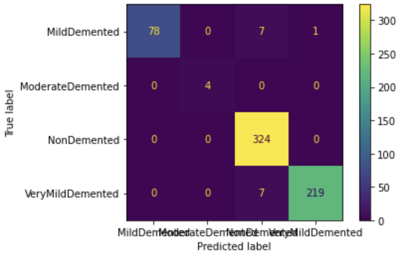

# 2D Alzheimer’s MRI Classification using Deep Learning

A deep learning project for multi-class Alzheimer’s disease classification from brain MRI images using transfer learning with PyTorch. This project evaluates convolutional neural network (CNN) architectures for distinguishing different stages of dementia from 2D MRI scans while addressing common challenges in medical imaging such as class imbalance and data leakage.

---

## Overview

Alzheimer’s disease is a progressive neurodegenerative disorder that affects memory and cognitive function. Early detection is important for clinical intervention and disease management.

This project develops a deep learning pipeline using transfer learning on pretrained CNN architectures to classify MRI brain images into four dementia categories:

| Class | Description |
|---|---|
| NOD | Non Demented |
| VMD | Very Mild Demented |
| MID | Mild Demented |
| MOD | Moderate Demented |

The project focuses not only on predictive performance, but also on:
- reproducible deep learning workflows,
- medical imaging evaluation metrics,
- class imbalance handling,
- and explainability for clinical interpretation.

---

## Dataset

MRI images were obtained from the Kaggle Alzheimer MRI dataset:

[Kaggle Alzheimer MRI Dataset](https://www.kaggle.com/datasets/tourist55/alzheimers-dataset-4-class-of-images)

The dataset contains labeled 2D MRI images corresponding to four dementia stages.

---

## Objectives

- Build a deep learning model for Alzheimer’s MRI classification
- Evaluate transfer learning strategies using pretrained CNN models
- Compare model performance across dementia stages
- Investigate the impact of data splitting strategies on model generalization
- Improve interpretability using visualization techniques

---

## Methods

### Deep Learning Framework
- PyTorch
- Torchvision
- Transfer Learning

### CNN Architectures Evaluated
- ResNet18
- ResNet34
- DenseNet121

### Data Processing
- Image resizing and normalization
- Data augmentation
- Stratified train/validation/test split

### Training Strategies
- Transfer learning with pretrained ImageNet weights
- Weighted cross-entropy loss for class imbalance
- Early stopping and model checkpointing

### Evaluation Metrics
- Accuracy
- Precision
- Recall
- F1-score
- ROC-AUC
- Confusion matrix

### Explainability
- Grad-CAM visualization
- Saliency map analysis

---

## Results

The ResNet34 transfer learning model achieved strong classification performance across Alzheimer’s disease stages on the test dataset.

### Confusion Matrix

<p align="center">
  
</p>

### Performance Summary

| Class | Correct Predictions | Total Samples |
|---|---:|---:|
| MildDemented | 78 | 86 |
| ModerateDemented | 4 | 4 |
| NonDemented | 324 | 324 |
| VeryMildDemented | 219 | 226 |

### Key Observations

- The model achieved excellent performance for the **NonDemented** and **VeryMildDemented** classes.
- Most classification errors occurred between **MildDemented** and **NonDemented**, reflecting the subtle visual differences between early dementia stages.
- The dataset exhibited substantial class imbalance, particularly for the **ModerateDemented** category with very few samples.
- Evaluation therefore emphasized not only overall accuracy, but also confusion matrix analysis and macro-level performance metrics.

### Important Consideration

Medical imaging datasets are highly susceptible to **data leakage**, especially when highly similar MRI slices from the same subject appear in both training and testing sets. Future work will incorporate patient-level splitting strategies and external validation to better assess model generalizability.

---

# Training Alzheimer MRI Classification Model with PyTorch

## Prepare Python Environment

```bash
conda create -n alzheimer-mri python=3.9
conda activate alzheimer-mri

# Install PyTorch with CUDA support
conda install pytorch torchvision torchaudio pytorch-cuda=11.8 -c pytorch -c nvidia

# Core libraries
pip install numpy==1.23.1
pip install pandas scipy scikit-learn

# Deep learning utilities
pip install tqdm wandb einops multipledispatch

# Visualization
pip install matplotlib seaborn plotly

# Image processing
pip install opencv-python Pillow

# Explainability
pip install grad-cam

# Jupyter environment
pip install notebook jupyter ipykernel

# Optional medical imaging support
pip install nibabel
```

## Clone Repository

```bash
git clone https://github.com/phuongov/Classification.git
cd alzheimers-mri-classification
```

## Train the Model

```bash
python train.py
```

---

## Project Structure

```text
alzheimers-mri-classification/
│
├── data/
│   ├── all/
│   ├── test/
│   ├── train/
│
├── notebooks/
│   ├── 01-Resnet34.ipynb
│   ├── 02-Resnet34.ipynb
│
├── figrues/
│   ├── confusion_matrix.png
│
├── train.py
├── evaluate.py
└── README.md